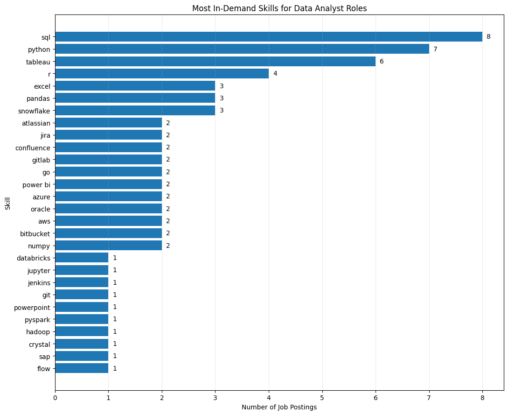
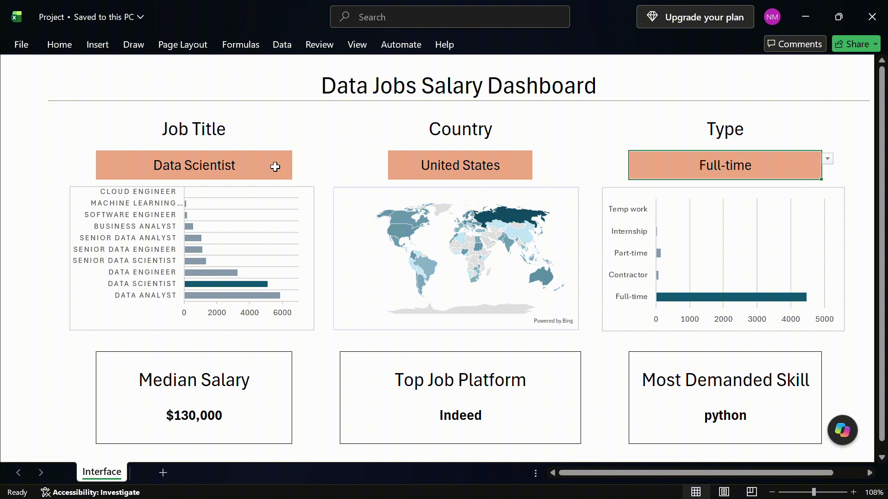

# 👋 Hi, I'm Manoah Noble

### Aspiring Data Analyst | SQL • Excel • Power BI

## About Me

I'm a Toronto-based data professional moving into data analytics from an SAP integration background. 

This portfolio shows how I work with data end to end:

## 🗂️ Portfolio at a Glance

| # | Project | Tool | What it answers | Link |
|---|---------|------|-----------------|------|
| 1 | **Data Jobs Analysis** | SQL (PostgreSQL) | Which skills and roles are the most in-demand and best-paid for data analysts? | [View project](sql-job-market) |
| 2 | **Salary Dashboard** | Excel | What do data roles pay by title, country, and schedule type, and what is the top skill for each? | [View project](excel-analysis) |
| 3 | **PowerBI Dashboard** | Power BI | An interactive PowerBI, which overviews the key KPIs extracted from the dataset | [View project](powerbi-dashboard) |

## 🔗 How the Projects Connect

All three projects explore the same question from different angles: **what does the data job market look like, and what should a job seeker learn or expect?**

- **SQL** is where I extract and clean answers from raw job-posting data.
- **Excel** is where I turn those numbers into an interactive salary dashboard with a top-skill card.
- **Power BI** is where I scale that into a polished, shareable dashboard.

---

## 1️⃣ SQL: Data Jobs Analysis

**Focus:** Top-paying jobs, skills required, in-demand skills, and the most optimal skills to learn for data analysts.

**Skills used:** Joins, CTEs, Aggregations, Filtering

**Key finding:** Sql tops the list for the most optimal skill for data analysts, with the highest frequency while also having a high median salary

👉 [Full project and queries](sql-job-market)

---

## 2️⃣ Excel: Salary Dashboard

**Focus:** An interactive dashboard that shows median salary by job title, country, and schedule type, with a map chart, a bar chart, and a **Top Skill card** that updates with the selections.

**Skills used:** Charts, array formulas, data validation dropdowns, dashboard cards, pivot tables, pivot charts.

**Key finding:** The median salary of the senior roles are much higher in comparision to the junior roles. The median salary for Data Analyst in the US is around $90k, with sql being the most in demand skill.

👉 [Full project and dashboard file](excel-analysis)

---

## 3️⃣ Power BI: Overiew Dashboard

**Focus:** ✏️ A quick and simple interactive dashboard to quickly analyse the job market data.

# Note: This section is still in progress

👉 [Full project and .pbix file](powerbi-dashboard)

---

## 🛠️ Skills Summary

| Area | Tools and Skills |
|------|------------------|
| **Querying** | SQL, PostgreSQL, joins, CTEs, aggregations |
| **Analysis** | Excel, array formulas, data validation, pivot tables |
| **Visualization** | Power BI, Excel charts and map charts |
| **Tools** | VS Code, Git, GitHub |
| **Background** | SAP CPI integration, testing and delivery, cybersecurity fundamentals |

## ⭐ Bonus Project: Gaussian Process Regression for Equity Markets

A Gaussian Process Regression model with an RBF kernel, built from scratch using the underlying theory and formulas, for equity market analysis.

👉 [View on GitHub](https://github.com/Manoah1401/GPR-Implementation)

## 📬 Let's Connect

- 💼 LinkedIn:  [Manoah Noble](https://linkedin.com/in/Manoahnoble)
- 🐙 GitHub: [Manoah1401](https://github.com/Manoah1401)
- 📧 Email:  manoahnob@gmail.com

> I'm currently looking for data analyst opportunities in the Toronto area.

---

## 🙏 Acknowledgments

A huge thank you to **[Luke Barousse](https://www.youtube.com/@LukeBarousse)** for mentoring me through this entire project. His courses, datasets, and teaching made it possible to go from learning the tools to building a portfolio I'm proud of. Thank you, Luke! 🙌